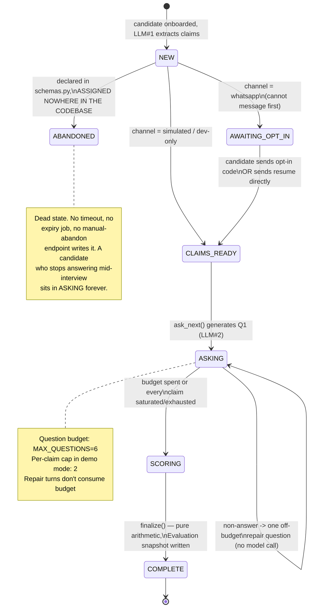
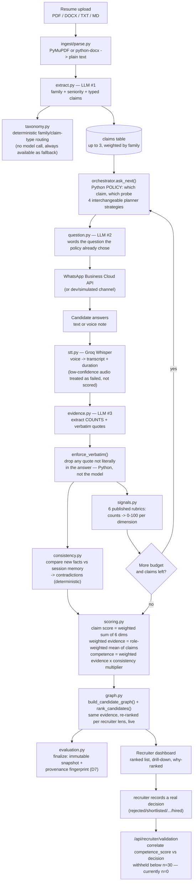

# ProofScreen — System Flow & Module Report

**Audience:** PM review of what the system does today, module by module, and
what is missing.
**Scope:** `api/` as of `main` @ `4db6c6f` (2026-09-07). This is a snapshot,
not a process document — it does not supersede or restate anything in
`docs/README.md`'s reading order. For binding architecture decisions, read
those documents; this one exists to give a PM a single place to judge the
system end to end.
**How this was produced:** direct reading of every engine module, router,
model, config flag and prompt listed below (file:line cited throughout), not
a summary of comments. The "Gaps" section (§7) is independent analysis, not
transcribed from existing docs, except where explicitly marked "known."

---

## 1. The one-paragraph pitch

A resume is a list of claims. ProofScreen extracts them, probes each one over
WhatsApp through a scripted interview, and extracts **countable signals** from
the answers — quantities, process steps, complete cause→action→outcome
chains, tools with described usage, specific remembered incidents — each
quoted **verbatim** from what the candidate actually typed or said. Published
arithmetic rubrics turn those counts into six dimension scores. A recruiter's
own weight profile turns dimension scores into a ranking. A deterministic
fact-memory catches contradictions between answers and multiplies the whole
score down. **The model never produces a score, an opinion, or a rating —
only counts of things it found and the verbatim quotes proving they're
there** (`api/main.py:7-20`, `api/schemas.py:1-30`).

---

## 2. The candidate journey (what actually happens, in order)

1. **Intake.** A recruiter uploads a resume (PDF/DOCX/TXT/MD, ≤10MB) via
   `POST /api/candidates`, or pastes text via `POST /api/candidates/text`
   (`api/routers/candidates.py:160-217`). A phone number is mandatory —
   WhatsApp is the only candidate channel (`api/routers/candidates.py:7-8`).
   PDF text comes from PyMuPDF, DOCX from python-docx, including table cells
   (`api/ingest/parse.py:31-62`). **A scanned/image-only PDF fails outright**
   with no OCR fallback — the candidate has to be re-onboarded via the text
   endpoint (`api/ingest/parse.py:87-91`).

2. **Extraction — LLM call #1** (`api/engine/extract.py`). One model call
   reads the resume and returns a job family plus a list of typed claims
   (`ClaimExtraction` → `job_family`, `claims[]`). Family routing is a
   4-rung waterfall: (1) the recruiter's stated requisition family always
   wins; (2) an optional title-based classifier (`role_classifier` flag,
   `extract.py:486-535`); (3) deterministic TF-IDF-style keyword scoring with
   no model call at all (`api/taxonomy.py:365-395`); (4) `general`. The same
   classifier call now also returns candidate **seniority**
   (junior/mid/senior/`None`), normalised in Python and persisted on
   `candidates.seniority` — added in the commit just before this report
   (`api/engine/extract.py:410-483`, `api/models.py:165-169`). Claims are
   capped at `MAX_CLAIMS=3` in the shipped demo config, ranked by the
   family's own importance weights (`api/config.py:38-39`,
   `api/taxonomy.py:155-158`).

3. **Session opens.** `orchestrator.create_session` writes the candidate,
   resume, claims and a `sessions` row (state `NEW`), plus a **draft**
   `Evaluation` row opened at the same moment the interview starts, not after
   it succeeds (`api/engine/orchestrator.py:939-1000`,
   `api/engine/evaluation.py:86-114`). WhatsApp cannot free-form message
   someone who hasn't messaged first, so the session moves to
   `AWAITING_OPT_IN` and an opt-in code is generated.

4. **Opt-in.** The candidate texts the opt-in code to the business number
   (or, in one shortcut path, sends their resume directly over WhatsApp,
   which is treated as an even stronger consent signal —
   `api/routers/whatsapp.py:310-329`). Either way the session moves to
   `CLAIMS_READY` and the first question goes out.

5. **The interview loop.** `orchestrator.ask_next` picks a claim and a probe
   target via a **pure-Python policy function** (no model call for the
   *decision* of what to ask), then calls **LLM call #2**
   (`api/engine/question.py`) only to word the question. Four different
   planner strategies exist behind flags (see §4); the shipped default is
   the **forensic Move planner**. Each answer comes back over WhatsApp (text
   or voice note), is scored, and the loop repeats until the question budget
   (`MAX_QUESTIONS=6`) is spent or every claim is saturated/exhausted.

6. **Scoring each answer — LLM call #3** (`api/engine/evidence.py`). The
   model reads one answer and the claim it targets, and returns *counts*:
   quantities, process steps, causal links, tool mentions, metric
   definitions, incident markers, named entities, and durable "facts" on a
   controlled vocabulary. **Every single quote is checked against the raw
   answer text in Python; anything not found verbatim is dropped before it
   can influence a score** (`enforce_verbatim`, `api/engine/evidence.py:247-278`).
   Facts are compared against everything the candidate has said before in
   this session to catch contradictions (`api/engine/consistency.py`).

7. **Finalization.** When the question budget is exhausted, `finalize()`
   moves the session `ASKING → SCORING → COMPLETE` (this transition is
   arithmetic only — no model call — and is effectively instantaneous:
   `api/engine/orchestrator.py:1638-1650`), recomputes the candidate's cached
   `Profile`, then **finalizes** the draft `Evaluation` — an immutable
   snapshot of the result, the weights it was scored under, and eight
   provenance fields (§6.9) — and stamps the whole thing with a content
   fingerprint (`api/engine/evaluation.py:117-223`).

## 3. The recruiter journey

- **Ranked list** — `GET /api/recruiter/candidates?role_id=...`. Every
  dimension score is already stored, so re-ranking under a different
  recruiter's weight profile is pure arithmetic over rows already in the
  database — no re-interview, no model call, milliseconds
  (`api/engine/graph.py:700-861`). Two calls with two `role_id`s producing
  two different orders over *identical* evidence is the product's core demo
  moment.
- **Drill-down** — `GET /api/recruiter/candidates/{id}`. The full claim →
  Q&A → dimension tree, with every quote attributed to the answer it came
  from.
- **Why-ranked** — every row in the ranked list carries one generated (not
  model-written) sentence citing the actual evidence counts, contradictions,
  and which claim type the current lens weights heaviest
  (`api/engine/graph.py:627-697`).
- **Weight profiles** — `POST /api/recruiter/roles` lets a recruiter type
  arbitrary weights (e.g. 40/30/20/20); they're rescaled to sum to 100
  automatically (`api/engine/scoring.py:287-305`).
- **Outcome recording** — `POST /api/recruiter/candidates/{id}/outcome`. One
  required field (`decision`: rejected → shortlisted → interviewed → offered
  → hired). Append-only by schema, not just convention — no unique
  constraint on `candidate_id`, so a candidate's real hiring progression is a
  provable timeline (`api/models.py:551-566`).
- **Validation report** — `GET /api/recruiter/validation`. Correlates
  `competence_score` against the *human* decisions just described. Below
  `minimum_n=30` it returns `sufficient=false` and **withholds** the
  correlation rather than reporting a number computed on noise
  (`api/routers/recruiter.py:352-388`). This is the single endpoint that
  makes the product's central claim ("evidence beats resume screening")
  falsifiable rather than self-referential — and, per `CLAUDE.md`, it
  currently reads **n = 0** in production. Nobody has recorded a real hiring
  decision against a ProofScreen evaluation yet.
- **Evaluation history / audit trail** — `GET
  /api/recruiter/evaluations/{id}/history` assembles a deterministic
  timeline from the evaluation's own lifecycle plus the append-only outcomes
  table. There is deliberately no separate events table
  (`api/models.py:551-566` docstring).

---

## 4. State machine



*(Source: `api/schemas.py:85-93` for the enum; transition sites:
`api/engine/orchestrator.py:939-1000, 1077-1290, 1486-1557, 1638-1650`,
`api/routers/whatsapp.py:310-329`, `api/routers/dev.py:183-209`.)*

---

## 5. The full pipeline



---

## 6. Module-by-module reference

### 6.1 `api/taxonomy.py` — the vocabulary everything else reads

Loads `data/claim_taxonomy.json` (9 families: `bpo_operations`,
`customer_support`, `sales`, `banking_operations`, `software_engineering`,
`data_analytics`, `hr_recruitment`, `product`, `general`). Answers four
questions with **zero model calls**: which family is this resume, which
claim type is this claim, which dimensions matter most for this family, and
which "facts" should the consistency engine track. Weights live in *data*,
not code — a PM can retune "team handling is worth 25 for a BPO Team Lead"
without a deploy (`taxonomy.py:1-14`).

- **Family routing** (`match_family`, `taxonomy.py:365-395`) is a TF-IDF-style
  cosine match over keyword hits, weighted so a term unique to one family
  counts more than one shared across several. Requires ≥2 distinct keyword
  hits to leave `general` at all (`MIN_TERMS=2`). Confidence is a **margin**
  (how far the winner beats the runner-up), not a probability — measured at
  `MARGIN_FLOOR=0.35` over a 64-entry golden set, and deliberately does *not*
  demote a low-confidence match to `general` (an under-route strips every
  claim type and weight the family carries, measured as worse than a
  visible low-confidence flag).
- Example weights, `bpo_operations`: `team_handling`=25,
  `csat_improvement`=20, `aht_control`=15, `sla_adherence`=15,
  `attrition_control`=10, `coaching_quality`=10, `workforce_planning`=5.
- Global dimension weight defaults: SPECIFICITY 0.20, PROCESS 0.20,
  AUTHENTICITY 0.20, CAUSAL_REASONING 0.15, METRIC_OWNERSHIP 0.15,
  TOOL_FAMILIARITY 0.10 — each family can override any subset, renormalised
  to sum to exactly 1.0.
- Versioned twice for provenance: `taxonomy_version` (hand-maintained intent,
  currently `tax_1`) and `taxonomy_hash` (sha256 of the actual file bytes) —
  because a weight retuned in data with no code change is exactly the kind
  of edit that should show up when a recruiter asks why a score moved.

### 6.2 `api/engine/extract.py` — LLM call #1: resume → family, seniority, claims

Takes the raw resume text and returns `(job_family, claims[], seniority)`.
Every claim is validated against the taxonomy in Python — a `claim_type` the
model invents is silently reclassified by keyword match
(`normalise_claim_type`), never trusted blindly.

- **What it extracts:** claim text, a taxonomy-validated `claim_type`, an
  optional metric string (`"41% -> 63%"` style), and — new as of this
  session — candidate seniority (`junior`/`mid`/`senior`/`None`), read once
  from an optional classifier call and passed straight through without ever
  being branched on inside this file (extraction never scores, per rule 1).
- **`claim_inventory` flag (default off):** when on, extraction becomes a
  pure recall step — every verifiable claim, no per-type cap, no top-N,
  ranking deferred to the interview policy. Off by default for a *measured*
  reason, not caution: `graph.py` currently scores every unprobed claim as 0
  at full weight, so turning inventory mode on before that changes would
  crater competence scores for reasons unrelated to evidence (`config.py:60-68`).
- **Fallback (`heuristic_claims`):** when the model is down or returns
  nothing usable, a regex/verb-scoring heuristic picks likely claim lines
  from the resume text directly — deliberately conservative, so a dead model
  degrades the interview rather than crashing it (rule 5).

### 6.3 `api/engine/anatomy.py` — claim decomposition (pure Python, no LLM)

Decomposes one claim sentence into: `mechanism` (how), `object` (what),
`metric_name`/`metric_value` (split apart on purpose — the *name* can be
asked about, the *value* must never be handed back to the candidate as the
answer), `scope` (counts to withhold, e.g. "35 agents"), `people`,
`dependencies` (named tools/systems), and an `archetype`
(`METRIC_MOVE`/`OWNERSHIP`/`BUILD`/`PROCESS`/`VOLUME`) that decides which
order the question moves below are tried in. Entirely regex-based and
deterministic — the same claim always decomposes the same way, which matters
because the planner branches on the result.

### 6.4 `api/engine/orchestrator.py` — the policy (no LLM decides *what* to ask)

The largest file in the codebase (1,971 lines) and the seam between every
other engine. Its job: given the session so far, decide which claim and
which evidence target to probe next — a pure function of stored state,
independently testable and replayable. Four interchangeable planner
strategies exist behind flags, checked in this priority order in `ask_next`
(`orchestrator.py:1090-1102`):

| Flag state | Planner used | What it plans |
|---|---|---|
| `demo_mode & forensic_questions & !evidence_planner_v2`, thread match found | `_thread_plan` | Lightweight canned follow-up when the last answer named a known entity (ticket, approval, manager...) — no model call |
| `evidence_planner_v2=true` | `plan_next_evidence` | **Prototype, exploratory.** `EvidenceCategory` vocabulary (ownership/process/metric_definition/decision/dependency/incident/constraint/causal_chain/artifact/cross_claim_link) instead of `Move`. Default off. |
| `forensic_questions=true` (**shipped default**) | `plan_next_forensic` | 9 `Move`s (METRIC_DEFINITION, OWNERSHIP_BOUNDARY, OPERATING_CONTEXT, FAILURE, EXCLUSION, DEPENDENCY, PEOPLE, AUTHORITY, COHERENCE, PERTURB), ordered per claim archetype |
| neither flag | `plan_next` | Legacy 5-level probe ladder (VALIDATION → OPERATIONAL → INCIDENT → DECISION → OUTCOME), plus one optional TRANSFER probe for a stalled claim |

Also owns: session-fact memory assembly (`known_facts`), the one-repair-per-
claim (demo mode) vs one-repair-per-probe-level (legacy) rule for non-answers
— including a **bug this session's commit fixed**: the legacy repair-eligibility
query only checked `order_index > this_question`, which can never see an
earlier question's already-spent repair, so a 2-claim demo-mode interview
was measured logging 3 repairs against a 2-claim ceiling
(`orchestrator.py:377-415`) — and the newly-added **candidate-level move
gate**: `AUTHORITY` now unlocks at mid/senior, `EXCLUSION`/`PERTURB` at
senior only, unknown seniority staying at today's unconditional-off
behaviour (`orchestrator.py:264-296`, `question.py:1004-1033`).

### 6.5 `api/engine/question.py` — LLM call #2: wording only (2,055 lines)

The single largest file. The **policy already chose** the claim and the
evidence target before this file is ever called; this file's only job is
turning that into natural WhatsApp language, with a hand-written fallback
for every path so a dead model degrades the wording, never the interview
(rule 5).

- **The 9 forensic Moves** (shipped default), each with exactly one ask —
  deliberately narrow, because a brief carrying several asks is a menu and
  the model reliably orders the cheapest item (measured: a 4-ask OUTCOME
  brief collapsed to "how did you measure it" and nothing else,
  `question.py:973-977`). Example: `METRIC_DEFINITION` asks how a number was
  *derived*, never what its value was — the value is already on the resume.
- **`validate()` — 7 deterministic rules, pure Python, no model call**
  (`question.py:479-617`): `answer_leakage` (a figure the claim already
  states), `unsupported_metric` (an invented figure), `duplicate_content`
  (Jaccard ≥0.37 against a prior question, discounting the claim's own
  vocabulary), `multiple_fact_targets`, `hypothetical_misuse` (a "what would
  you do" outside the one probe level designed for it), `scope_drift`,
  `no_claim_anchor`. **Every rule always runs** — no short-circuiting —
  because M6 (question-quality reporting) counts violations per rule and a
  short-circuit would silently zero every rule after the first hit.
- **Two attempts, and the second one changes the *target*, not the
  wording** — a design correction from measured data: the old
  probe-level generator told a rejected model which rule it tripped and
  asked again, and 19% of regenerations satisfied the validator by deleting
  the offending token ("the team of 35 agents" → "the team of agents":
  compliant, ungrammatical, useless). The forensic generator instead swaps
  to a *different* Move entirely on attempt 2 (`question.py:1627-1643`).
- **Anatomy-built fallbacks** never trip `answer_leakage` by construction
  (they interpolate only figure-stripped `object`/`mechanism`/`metric_name`,
  never `metric_value` or `scope`) — so, unlike the legacy probe-level
  fallback, they don't need a validation exemption.
- **`live_question_quality_log` (default off):** an *offline-only* second
  model call per turn that scores the just-sent question on 7 axes
  (clarity, specificity, naturalness, single_focus, answerability,
  evidence_yield, relevance_to_claim) and logs it. Fire-and-forget
  (`asyncio.create_task`, never awaited) — cannot gate or delay the
  interview, cannot influence a score, exists purely for offline quality
  monitoring. Real ongoing model-call cost if turned on.
- **Candidate-level gate (new this session):** `LEVEL_RESTRICTED` maps
  `AUTHORITY→{mid,senior}`, `EXCLUSION→{senior}`, `PERTURB→{senior}`; every
  other Move is unrestricted at every seniority (`question.py:1004-1033`).

### 6.6 `api/channels/` + `api/routers/whatsapp.py` — the only candidate channel

WhatsApp Business Cloud API, direct integration with Meta (no vendor). Real
constraints baked in and handled: the 24-hour free-form messaging window
(opt-in exists specifically to open it), Meta retrying webhooks (de-duplicated
on `provider_message_id` — without this, one retry desyncs the whole
interview), one webhook payload potentially carrying several messages (most
of them delivery-status noise, not candidate replies — `parse_inbound`
returns a list for exactly this reason), the webhook returning 200
immediately with real work in a `BackgroundTask`, and media downloads
needing the bearer token on *both* calls (id→URL, then URL→bytes — missing
it on the second looks like your own bug, not Meta's). `X-Hub-Signature-256`
is verified over the **raw** body, because re-serializing parsed JSON changes
byte-for-byte content and the signature never matches again.

### 6.7 `api/stt.py` + `api/engine/voice.py` — voice notes

Transcription via Groq's hosted Whisper (`whisper-large-v3-turbo`), no
language forced (the candidate population code-switches Hindi/English
mid-answer). A measured fix: low-confidence audio (via Whisper's own
`no_speech_prob`/`avg_logprob`) is now treated as a **failed** transcription,
routed to "please resend," rather than scored as if it were the candidate's
real words — two real interviews had previously been silently scored on
garbled Hindi. Voice contributes a small, fixed 10% of a claim's score
(`VOICE_WEIGHT`), and only for voice-answered claims — text-only claims are
scored on content alone. **What is measured:** duration and word count only.
**What is explicitly refused, as a stated product decision:** accent,
fluency, grammar, pause pattern, "speech confidence" — in India these track
region/schooling/class far more than competence (`voice.py:1-16`).

### 6.8 `api/engine/evidence.py` — LLM call #3: answer → signals, facts, verbatim check

The seam Developer B owns. Three guarantees enforced **in Python, not
requested in a prompt**: (1) verbatim — any quote not literally present in
the answer is dropped before it can touch a score; (2) no model scores —
only counts and quotes reach the rubric; (3) controlled fact keys — a fact
on a key outside the taxonomy's vocabulary is discarded, because an open key
space would let the model invent a fresh key per answer and thereby never
contradict itself. Also owns `is_non_answer()` (the repair-turn trigger) and
the heuristic fallback (`heuristic_signals`) used in fixture mode or when the
model is unavailable.

### 6.9 `api/engine/signals.py` — the published rubrics (no LLM)

**This is the file that makes the whole product defensible.** Every rubric
is the same shape: `score = 100 × min(1, weighted_count / TARGET)`, then a
**gate** caps the score if a necessary ingredient is missing entirely (e.g.
SPECIFICITY caps at 55 with zero quantities named, however many entities are
listed). Targets are deliberately low (2–5 signals) — a real practitioner
answering a direct question about their own work produces these almost
involuntarily; someone who didn't do the work can't produce them at all.

| Dimension | Target | Gate cap | Gate condition |
|---|---|---|---|
| SPECIFICITY | 5.0 | 55 | no quantity given |
| PROCESS | 4.0 | 50 | no process step described |
| METRIC_OWNERSHIP | 2.0 | 45 | metric named but never defined |
| CAUSAL_REASONING | 2.0 | 50 | no complete cause→action→outcome chain |
| AUTHENTICITY | 3.0 | 40 | no specific incident recalled |
| TOOL_FAMILIARITY | 2.0 | 40 | tool named but usage not described |

**Evidence accumulates across a claim's answers** — the rubric runs once
over the *union* of everything said about a claim, deduplicated by content,
not the best single answer. (Best-of under-credited candidates who spread
evidence across probe levels, which is exactly what a 5-move interview asks
them to do.) `probed` is tracked separately from `score=0`, so a claim nobody
asked about reads differently from one the candidate failed to answer.

### 6.10 `api/engine/consistency.py` — deterministic contradiction detection (no LLM)

The one distinction that makes this work: fact keys are `stable` (team size,
tenure — a divergence between answers is a contradiction) or `variable`
(CSAT, AHT — the value is *supposed* to move; "78 then 92" is the
improvement being claimed, not a lie). Divergence on a stable numeric fact:
<10% is human approximation (ignored), ≥10% is MINOR (−15 points), ≥50% is
MAJOR (−40 points), floored at 20 so one contradiction can't zero a
candidate outright. Applied **once, session-wide**, as a multiplier on the
final weighted-evidence score — never inside a single claim — because
consistency is a property of the whole interview, and double-penalizing one
lie both per-claim and as a multiplier would be counted twice.

### 6.11 `api/engine/scoring.py` — the arithmetic (no LLM, "the file you open on the projector")

```
dimension score  (signals.py, published rubrics)
    |
    v
claim score       = SUM over 6 dimensions of  dimension_weight × dimension_score
    |
    v
weighted evidence = SUM over claims of  claim_weight × claim_score   (claim_weight from the ROLE)
    |
    v
competence score  = weighted evidence × consistency multiplier
    |
    v
badge             verified ≥ 70, partial ≥ 40, else unverified
```
An un-probed dimension contributes **0**, deliberately — this is a
*confidence* score, and one great answer on one dimension isn't confidence
in the whole claim; `probed_dimensions` is reported alongside so thin
questioning is visible as such rather than hidden inside a number.
`resume_score` is a separate, **deliberately shallow** contrast metric —
keyword overlap against the job description, exactly what a GenAI-polished
resume is built to maximize — whose only job is to sit next to
`competence_score` and look embarrassingly different.

### 6.12 `api/engine/graph.py` — assembly and ranking

Two jobs: `build_candidate_graph()` (the claim → Q&A → dimension tree the
dashboard renders) and `rank_candidates()` (the ranked list *for a given
role*). Every dimension score is already stored, so re-ranking for a
different recruiter is arithmetic over existing rows — no model call, no
re-interview, milliseconds. `routing_confidence` on the graph is a **margin**
against the family the candidate was *actually scored under*, not the
family the detector would have preferred — a distinction the code fixed
after finding two seeded personas reporting a confident-looking number
against the wrong question entirely (`family_margin`, cited in
`graph.py:432-461`).

### 6.13 `api/engine/evaluation.py` + `provenance.py` + `replay.py` — the immutable record

- **`Evaluation`** (`api/models.py:446-517`): `draft → finalized`, two states
  only, enforced *twice* — once in the service function, once by a
  SQLAlchemy `before_update` listener that raises on **any** update to an
  already-finalized row, catching a future callsite nobody remembered to
  route through the service function (`models.py:623-648`). Stores the
  result and the configuration it was produced under — never a copy of the
  evidence itself, which stays addressable through the same graph
  drill-down it always was.
- **Provenance** (`provenance.py`): every evaluation is stamped with
  `taxonomy_version@hash`, `rubric_version`, `scoring_version`,
  `question_policy_version`, a hash per prompt template, `code_version`,
  `app_version`, `llm_mode`, the model requested, the model that actually
  answered (recorded but excluded from the identity hash, since it's a
  per-process observation), and an **allowlist of 10 feature-flag values**
  — see §7.1, this allowlist is measurably stale.
- **Replay** (`replay.py`): a narrower and more honest contract than "replay
  the interview." Extraction and question generation are historical
  artifacts, read never re-created (LLM output isn't deterministic even at
  temperature 0). Everything **downstream of stored signals** — rubric →
  claim score → weighted evidence → consistency multiplier → competence —
  is replayed through the exact same functions the live path calls, never a
  parallel copy of the arithmetic. Missing signal data fails loudly (a 409
  naming what's absent) rather than silently reporting a confident lower
  number computed from a hole.

### 6.14 `api/tenancy.py` + `api/models.py` (Tenant/ApiKey) — the ownership boundary

One architectural rule, enforced in exactly two functions: no handler
anywhere writes `tenant_id ==` by hand. A `TenantScope` (from
`Depends(current_tenant)`) is threaded through `scoped()` (adds the
predicate to a `select`) and `get_owned()` (primary-key fetch that returns
`None`, not a 403, for another tenant's row — a 403 would confirm the row
exists, which is a disclosure in a hiring product). `TenantScope.system()` is
the one bypass, mandatory reason string, exactly two call sites in the
codebase (the WhatsApp webhook resolving an inbound message before any
tenant is known, and seeding). **This is not authentication** — no users, no
roles, no rotation, no expiry, one shared sha256-hashed API key per tenant,
returned exactly once at creation and unrecoverable after
(`tenancy.py:27-31`, `111-133`). Currently `require_api_key` **defaults
false**, meaning an unkeyed request is served as the named development
tenant rather than rejected — must be flipped before any URL is public
(`config.py:154`, flagged in `CLAUDE.md` already).

### 6.15 Config flags that change product behaviour (`api/config.py`)

| Flag | Default | Effect |
|---|---|---|
| `demo_mode` | `true` | Bundles: 2 questions/claim cap, EXCLUSION/AUTHORITY/PERTURB gated (now by seniority instead of unconditionally off), answer-threading, one-repair-per-claim |
| `max_questions` / `max_claims` | 6 / 3 | Interview size |
| `forensic_questions` | `true` | Move-based generator (shipped) vs legacy probe-level ladder |
| `evidence_planner_v2` | `false` | Prototype `EvidenceCategory` planner, not production-ready (see §7.2) |
| `role_classifier` | `true` | Extra LLM call for family+seniority from the resume title/header |
| `claim_inventory` | `false` | Recall-first extraction — off because `graph.py` isn't ready for it (§7.3) |
| `adaptive_probing` | `true` | `false` = strict VALIDATION→OUTCOME sweep, no adaptivity |
| `question_validation` | `true` | The 7-rule validator + one regeneration |
| `repair_turn` | `true` | One off-budget retry on a non-answer |
| `transfer_probe` | `false` | The TRANSFER/PERTURB "what if" probe for stalled claims |
| `live_question_quality_log` | `false` | Second LLM call/turn, offline monitoring only |
| `score_inline` | `true` | `false` = scoring moves to a background task |
| `voice_weight` | 0.10 | Voice's share of a claim's score |
| `require_api_key` | `false` | **Must be `true` before any URL is public** |
| `whatsapp_validate_signature` | `false` | HMAC verification of inbound webhooks |
| `enable_dev_endpoints` | `true` | Exposes `/api/dev/*` (simulate, replay, reset, LLM diagnostics) |

---

## 7. Gaps, risks and recommendations

Items marked **(known)** are already flagged in `CLAUDE.md`; the rest are
findings from this review.

### 7.1 The provenance fingerprint does not cover the flags that most change what a candidate is asked — *new finding*

`evaluation_version` is described in `provenance.py` as answering "was this
the same system?" with the guarantee that "two evaluations are comparable if
and only if it matches." But the `FEATURE_FLAGS` allowlist it hashes
(`provenance.py:73-84`) is: `adaptive_probing`, `transfer_probe`,
`question_validation`, `repair_turn`, `score_inline`, `voice_weight`,
`max_questions`, `max_claims`, `claim_inventory`, `max_inventory_claims`. It
**does not include** `demo_mode`, `forensic_questions`,
`evidence_planner_v2`, or `role_classifier`. Concretely: `forensic_questions`
switches between two entirely different question-generation architectures
(Move-based vs. probe-level ladder) — the code's own comment calls this "the
FORENSIC shape... changes which questions a candidate is asked more
completely than any previous bump" — and yet two evaluations produced under
`forensic_questions=true` and `forensic_questions=false`, with everything
else identical, would receive **the same `evaluation_version` fingerprint**.
The same is true of `role_classifier` (whether seniority is ever captured at
all) and the seniority-based move-gating just shipped. **Recommendation:**
add these four flags to `FEATURE_FLAGS` before relying on
`evaluation_version` to answer "why did this score change" across the
Phase 2→Forensic transition, or across the seniority-gating change in this
commit.

### 7.2 Two parallel, partially-overlapping question planners in production code

`plan_next_forensic` (shipped) and `plan_next_evidence` (`evidence_planner_v2`,
explicitly "exploratory... CROSS_CLAIM_LINK is never offered... OWNERSHIP/
ARTIFACT are permanently under-signalled" per its own config comment) coexist
as full parallel implementations — separate Move/EvidenceCategory
vocabularies, separate prompt files (`forensic_question.txt` vs.
`v2_forensic_question.txt`), separate ledger-building logic. This is a real
maintenance and reasoning cost even with the flag defaulted off: a bug fix to
the forensic planner (like the repair-eligibility fix in this commit) has no
counterpart check against the v2 path, and a future engineer reading
`orchestrator.py` has to hold both mental models simultaneously.
**Recommendation:** either commit to a timeline for replacing the forensic
planner with v2, or remove `evidence_planner_v2` and its supporting code
until that decision is made — a flag that's been "exploratory" across
multiple phase boundaries accumulates risk with no offsetting benefit while
it stays unused in production.

### 7.3 The core validation metric (M4a) has never been computed on real data **(known, restated with the exact mechanism)**

`GET /api/recruiter/validation` is the only endpoint that correlates
`competence_score` against a real human hiring decision — the entire
product's justification ("evidence beats resume screening") is currently
**unfalsified, not falsified**: n=0. Every other number in the schema is,
in the codebase's own words, "ProofScreen measuring itself." Until
recruiters actually record outcomes through `POST
/api/recruiter/candidates/{id}/outcome`, there is no way to know whether a
higher `competence_score` predicts anything a human would recognize as
better hiring. This isn't a code defect — the mechanism is built and
correct — it's a product-adoption gap: nothing in the flow *requires* a
recruiter to close the loop, and the risk register already names this as
the top entry (`recruiter.py:151-154`). **Recommendation:** consider whether
the recruiter dashboard should nudge or gate on outcome-recording (e.g.
surfacing "you have N candidates with no recorded outcome") — right now
recording is possible but nothing in the UX pulls a recruiter toward it.

### 7.4 `ABANDONED` is a dead state — no session timeout exists **(known, from `CLAUDE.md`; expanded here)**

`SessionState.ABANDONED` is declared and read in three places, written in
zero. There is no background job, no TTL, no manual "mark abandoned"
endpoint. A candidate who answers two of six questions and then stops
responding leaves a `sessions` row parked in `ASKING` forever — indefinitely
consuming a `current_claim_id`/`current_probe_level` pointer, never reaching
`finalize()`, and therefore **never producing an `Evaluation` at all** — not
even a partial one. The recruiter dashboard has no way to distinguish "still
mid-interview" from "gave up three days ago" other than reading
`last_inbound_at` by hand. **Recommendation:** this is worth prioritizing
ahead of a production launch — a real candidate pool will have a
non-trivial abandonment rate, and right now those candidates are simply
invisible to the ranked list (no `Evaluation`, so no `competence_score`) with
no operational visibility into how many there are.

### 7.5 No path for a scanned or image-only resume

`ingest/parse.py` raises `UnsupportedResume` outright for a PDF that yields
<80 characters of extracted text, with the only remedy being "paste the text
into `POST /api/candidates/text` instead" — which requires the *recruiter*,
not the candidate, to manually retype the resume. **Recommendation:** at
minimum, surface this failure mode clearly in the recruiter-facing upload
flow rather than as a raw 400; OCR is a larger lift that may not be worth it
for a hackathon-scale product but is worth a conscious decision either way.

### 7.6 Synchronous LLM call #3 sits in the WhatsApp request path by default

`score_inline=true` (the default) means every candidate answer triggers a
full LLM call (up to `llm_timeout_seconds=25.0`) **before** the next
question is generated and sent back — two sequential model calls (evidence
extraction, then question generation) between "candidate hits send" and
"candidate sees the next question." On a slow or degraded OpenAI day this is
a felt WhatsApp delay of potentially 30–50 seconds per turn, with no
"typing..." indicator possible over the Cloud API. `score_inline=false`
exists as an escape hatch (scoring moves to a background task) but changes
when contradictions are visible to nothing downstream until the background
pass runs. **Recommendation:** worth a real latency measurement (P50/P95
turn time under live LLM calls, not fixture mode) before assuming the
default is right for a real candidate population rather than a demo booth.

### 7.7 No rate limiting anywhere in the API

`api/main.py` registers CORS middleware only — no request rate limiting on
any endpoint, including the public WhatsApp webhook and the resume-upload
endpoint (which triggers a paid LLM call per submission). **Recommendation:**
before the URL is public (the same milestone `CLAUDE.md` already names for
`require_api_key`), add basic rate limiting — a burst of resume uploads or
malicious webhook traffic currently has no backpressure at all.

### 7.8 The DPDP / data-retention workstream is untouched **(known, and correctly flagged as outranking everything else)**

Candidate resumes, phone numbers, verbatim transcripts of interview answers,
and voice recordings all persist indefinitely with no retention policy, no
deletion endpoint, and no consent-withdrawal path visible in the routers.
`CLAUDE.md` already states this "outranks all of this commercially" — this
review did not find any code addressing it, which is consistent with that
assessment rather than a new finding.

### 7.9 Auth is one shared key per tenant, no user-level accountability **(known)**

Every recruiter at a customer shares one API key. `decided_by` on
`CandidateOutcome` is a free-text field, not tied to any authenticated
identity — so "who actually rejected this candidate" is whatever string the
frontend happened to send, not a verified fact. Fine for a single-tenant
hackathon demo; a real customer with multiple recruiters will need to know
who made which call.

### 7.10 WhatsApp document-intake dedup is in-process only, not durable — *new finding*

`Response.provider_message_id` has a **database-level unique constraint**, so
the ordinary answer-dedup path survives a process restart. But the separate
path for "candidate sends their resume as a WhatsApp document" guards against
Meta's retry with `_CLAIMED_DOCS`, a plain in-process Python `set()`
(`api/routers/whatsapp.py`, per direct-review notes: "explicitly does not
survive a process restart"). If the API process restarts (a deploy, a crash,
a container recycle) in the narrow window between Meta's original delivery
and its retry of the same document upload, the retry is no longer recognized
as a duplicate and the candidate can be onboarded — and billed an LLM
extraction call — twice. **Recommendation:** move this guard to the same
DB-unique-constraint pattern already used for answers, or accept the
exposure explicitly as a known, low-probability edge case.

### 7.11 Minor: a stale comment contradicts the code it sits next to

`api/models.py:580` still reads "SQLite runs with PRAGMA foreign_keys=0,"
but `api/db.py` explicitly arms `PRAGMA foreign_keys=ON` for every SQLite
connection (`_arm_sqlite_foreign_keys`, `db.py:47-49`) — a fix `CLAUDE.md`
itself already records as shipped ("`api/db.py` now arms `PRAGMA
foreign_keys=ON`..., so all 17 `ondelete` clauses execute under test instead
of only on Postgres"). Not a functional bug — just a comment left behind by
the fix — but worth a one-line cleanup so a future reader doesn't trust the
stale claim over the code.

### 7.12 Minor: `repair_turn` is measured to never fire on real traffic **(known, from Phase 3)**

`is_non_answer()` (the repair-turn trigger) requires a canned phrase or
<12 characters. Measured over 68 real interviews in the Phase 3 study, it
fired **zero times** — no real candidate types a message short enough or
generic enough to trigger it, even when clearly not answering the question.
This means the repair-turn feature, as built, currently provides no
protection against a disengaged candidate consuming their question budget on
non-answers. Reported honestly in the Phase 3 study as a failed acceptance
criterion rather than patched to pass.

---

## 8. Full API surface

Five routers, all mounted in `api/main.py:103-107`. "Scope" = requires
`Depends(current_tenant)` (an `X-API-Key`, or falls back to the `t_dev`
development tenant while `require_api_key=false`).

| Prefix | Method & path | Scope? | Purpose |
|---|---|---|---|
| — | `GET /` | no | Service metadata |
| — | `GET /api/health` | no | DB check + provenance version stamp |
| `/api/candidates` | `POST /api/candidates` | yes | Onboard via file upload (PDF/DOCX/TXT/MD) |
| `/api/candidates` | `POST /api/candidates/text` | yes | Onboard via raw resume text |
| `/api/sessions` | `GET /api/sessions/{id}` | yes | Live session state + open question |
| `/api/webhooks` | `GET /api/webhooks/whatsapp` | no (Meta handshake) | Webhook subscription verification |
| `/api/webhooks` | `POST /api/webhooks/whatsapp` | no (HMAC-gated) | Inbound WhatsApp messages |
| `/api/recruiter` | `GET /api/recruiter/candidates` | yes | Ranked list, optional `role_id` re-rank |
| `/api/recruiter` | `GET /api/recruiter/candidates/{id}` | yes | Full evidence graph |
| `/api/recruiter` | `GET /api/recruiter/roles` | yes | List weight profiles |
| `/api/recruiter` | `POST /api/recruiter/roles` | yes | Create a weight profile |
| `/api/recruiter` | `POST /api/recruiter/candidates/{id}/outcome` | yes | Record a real hiring decision (append-only) |
| `/api/recruiter` | `GET /api/recruiter/candidates/{id}/outcomes` | yes | Decision history, oldest first |
| `/api/recruiter` | `GET /api/recruiter/candidates/{id}/evaluations` | yes | Evaluation history, newest first |
| `/api/recruiter` | `GET /api/recruiter/evaluations/{id}` | yes | One finalized (or draft) evaluation |
| `/api/recruiter` | `GET /api/recruiter/evaluations/{id}/history` | yes | Audit timeline (lifecycle + decisions) |
| `/api/recruiter` | `GET /api/recruiter/validation` | yes | M4a: score-vs-outcome correlation, withheld below n=30 |
| `/api/recruiter` | `GET /api/recruiter/taxonomy` | no | Read-only taxonomy view for the weight editor |
| `/api/dev` *(all 404 if `enable_dev_endpoints=false`)* | `POST /api/dev/simulate` | yes | Full pipeline in one call — no WhatsApp needed |
| `/api/dev` | `POST /api/dev/sessions/{id}/start` | yes | Skip opt-in, ask the first question |
| `/api/dev` | `POST /api/dev/sessions/{id}/answer` | yes | Step one answer without WhatsApp |
| `/api/dev` | `GET /api/dev/fixture` | no | Static sample evidence graph |
| `/api/dev` | `GET /api/dev/detect` | no | Explain family routing for arbitrary text, no model call |
| `/api/dev` | `POST /api/dev/tenants` | no | Provision a tenant + one-time raw API key |
| `/api/dev` | `POST /api/dev/replay/{evaluation_id}` | yes | Deterministic replay / drift check |
| `/api/dev` | `GET /api/dev/provenance` | no | Current version stamp + what's hashed vs. excluded |
| `/api/dev` | `GET /api/dev/llm` | no | LLM cache/fallback/failure stats |
| `/api/dev` | `POST /api/dev/reset` | no | Drop and recreate every table |

Two endpoints deliberately skip opt-in/phone verification for testing
(`/api/dev/sessions/{id}/start` and `/answer`) — both are gated behind
`enable_dev_endpoints` (default `true`) and must never be reachable by a real
candidate.

---

## 9. What's computed vs. extracted vs. generated vs. scored — quick glossary

| Term | Meaning here | Who produces it |
|---|---|---|
| **Extracted** | Claims from a resume; signals/facts from an answer | LLM #1 / LLM #3, always verbatim-checked in Python before use |
| **Generated** | The wording of a question | LLM #2, wording only — *what* to ask is decided by Python first |
| **Calculated / Scored** | Dimension scores, claim scores, weighted evidence, competence score, consistency multiplier, resume_score, routing_confidence, badge | Pure Python arithmetic, zero model calls — `signals.py`, `scoring.py`, `consistency.py`, `taxonomy.py` |
| **Ranked** | The recruiter's candidate list order | `graph.rank_candidates()` — arithmetic re-weighting of already-stored scores, no re-scoring |
| **Never produced by the model** | A rating, a confidence value, a percentage, an opinion of any kind | Enforced structurally: two tests (`test_scoring_modules_never_import_the_llm`, `test_answer_signals_carries_no_score_field`) fail the build if this is violated |

---

## 10. Health snapshot at time of writing

- **499 tests passing**, 1 pre-existing failure in `test_provenance.py`
  (`test_every_versioned_input_has_a_value` — an assertion pinning an exact
  set of prompt filenames that predates recent prompt renames; confirmed
  present on a clean `main` checkout before this session's changes, not
  introduced by them).
- Phases 1, 2 and 4 complete per `CLAUDE.md`; Phase 3 (real-interview
  validation study) is running and explicitly **blocked on a human** —
  100 blind-labeled question samples awaiting review before the
  question-validator's real-world accuracy can be computed.
- This session's commit (`4db6c6f`) added candidate-seniority gating for 3
  of 9 forensic Moves and fixed a measured repair-turn double-count bug; it
  has not yet been measured against a live interview population (no A/B, no
  before/after numbers exist for it yet, unlike the demo-mode change it
  builds on).

---

*Compiled by direct source review — every file cited above was read in full
or in the relevant section, not summarized secondhand. Ping the author before
treating §7 as exhaustive; it reflects one review pass, not a security audit
or a load test.*
